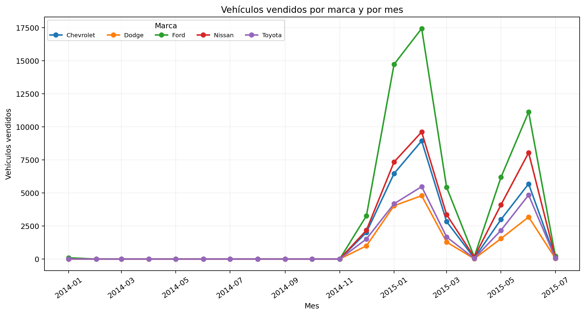
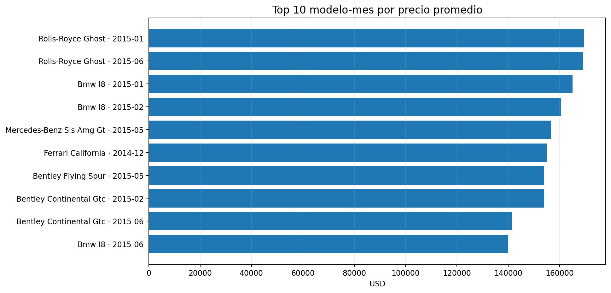
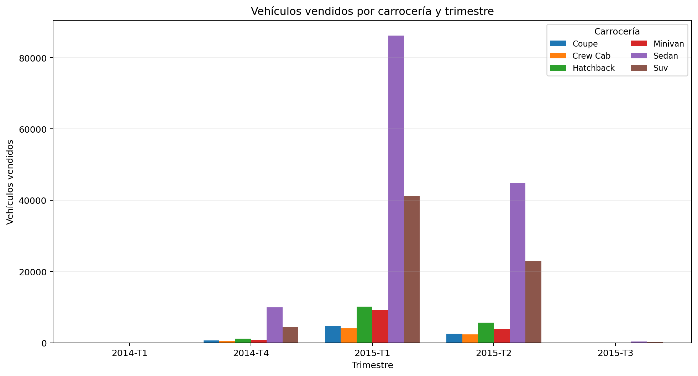
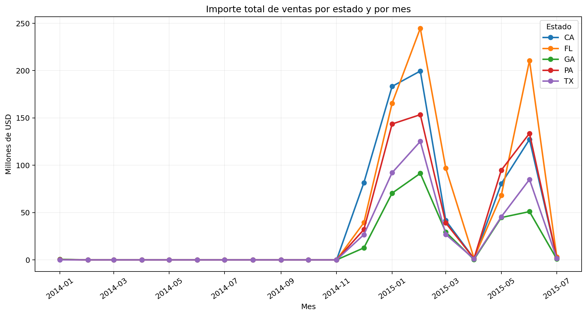
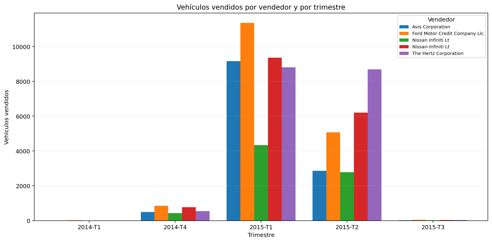
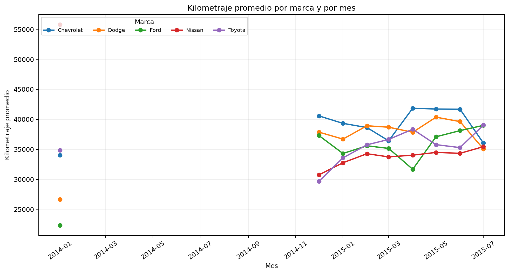

# Dashboard — Ventas de vehículos

**Materia:** Base de Datos Aplicada  
**Proyecto:** Data Mart de Ventas de Vehículos — HEFESTO  
**Integrantes:** Justo Solana Allende, Salvador Solana Allende y Agustín Rodríguez Richard

---

## Resumen general

El dashboard responde las seis preguntas de negocio definidas en el Paso 1 utilizando el modelo estrella cargado en MySQL.

- **Ventas analizadas:** 290.933
- **Importe total:** USD 5.292.283.858,00
- **Precio promedio:** USD 18.190,73
- **Kilometraje promedio:** 33.636,18

> En las preguntas 2 y 6 se utiliza el nivel **mes**, tal como se corrigió en el Paso 3 luego de analizar la fuente real.

---

## Pregunta 1

### ¿Cuántos vehículos se vendieron por marca y por mes?

```sql
SELECT
    t.anio,
    t.mes,
    t.nombre_mes,
    v.marca,
    SUM(f.cantidad_vendidos) AS cantidad_vehiculos
FROM fact_ventas f
JOIN dim_tiempo t
    ON f.id_tiempo = t.id_tiempo
JOIN dim_vehiculo v
    ON f.id_vehiculo = v.id_vehiculo
GROUP BY
    t.anio,
    t.mes,
    t.nombre_mes,
    v.marca
ORDER BY
    t.anio,
    t.mes,
    cantidad_vehiculos DESC;
```

### Resultado destacado

|   Año |   Mes | Nombre   | Marca     |   Vehículos |
|------:|------:|:---------|:----------|------------:|
|  2015 |     2 | febrero  | Ford      |       17440 |
|  2015 |     1 | enero    | Ford      |       14724 |
|  2015 |     6 | junio    | Ford      |       11122 |
|  2015 |     2 | febrero  | Nissan    |        9613 |
|  2015 |     2 | febrero  | Chevrolet |        8937 |
|  2015 |     6 | junio    | Nissan    |        8045 |
|  2015 |     1 | enero    | Nissan    |        7340 |
|  2015 |     1 | enero    | Chevrolet |        6466 |
|  2015 |     5 | mayo     | Ford      |        6190 |
|  2015 |     6 | junio    | Chevrolet |        5688 |

### Gráfico



### Interpretación

**Ford** fue la marca con mayor cantidad total de vehículos vendidos, con **58,665** unidades.

El gráfico mantiene todos los meses entre enero de 2014 y julio de 2015. Los meses sin ventas aparecen en cero, evitando saltos visuales entre períodos.

---

## Pregunta 2

### ¿Cuál fue el precio promedio de venta por modelo y por mes?

```sql
SELECT
    t.anio,
    t.mes,
    t.nombre_mes,
    v.marca,
    v.modelo,
    ROUND(
        SUM(f.importe_total) / SUM(f.cantidad_vendidos),
        2
    ) AS precio_promedio
FROM fact_ventas f
JOIN dim_tiempo t
    ON f.id_tiempo = t.id_tiempo
JOIN dim_vehiculo v
    ON f.id_vehiculo = v.id_vehiculo
GROUP BY
    t.anio,
    t.mes,
    t.nombre_mes,
    v.marca,
    v.modelo
ORDER BY
    t.anio,
    t.mes,
    precio_promedio DESC;
```

### Resultado destacado

|   Año |   Mes | Nombre    | Marca         | Modelo          | Precio promedio   |
|------:|------:|:----------|:--------------|:----------------|:------------------|
|  2015 |     1 | enero     | Rolls-Royce   | Ghost           | USD 169,500.00    |
|  2015 |     6 | junio     | Rolls-Royce   | Ghost           | USD 169,166.67    |
|  2015 |     1 | enero     | Bmw           | I8              | USD 165,000.00    |
|  2015 |     2 | febrero   | Bmw           | I8              | USD 160,600.00    |
|  2015 |     5 | mayo      | Mercedes-Benz | Sls Amg Gt      | USD 156,500.00    |
|  2014 |    12 | diciembre | Ferrari       | California      | USD 155,000.00    |
|  2015 |     5 | mayo      | Bentley       | Flying Spur     | USD 154,000.00    |
|  2015 |     2 | febrero   | Bentley       | Continental Gtc | USD 153,833.33    |
|  2015 |     6 | junio     | Bentley       | Continental Gtc | USD 141,500.00    |
|  2015 |     6 | junio     | Bmw           | I8              | USD 140,000.00    |

### Gráfico



### Interpretación

Los precios promedio más altos se concentran en modelos de alta gama.

El promedio se recalcula de forma ponderada:

`SUM(importe_total) / SUM(cantidad_vendidos)`

De esta manera se evita el error de promediar directamente los promedios almacenados en la tabla de hechos.

---

## Pregunta 3

### ¿Cuántos vehículos se vendieron por tipo de carrocería y por trimestre?

```sql
SELECT
    t.anio,
    t.trimestre,
    v.carroceria,
    SUM(f.cantidad_vendidos) AS cantidad_vehiculos
FROM fact_ventas f
JOIN dim_tiempo t
    ON f.id_tiempo = t.id_tiempo
JOIN dim_vehiculo v
    ON f.id_vehiculo = v.id_vehiculo
GROUP BY
    t.anio,
    t.trimestre,
    v.carroceria
ORDER BY
    t.anio,
    t.trimestre,
    cantidad_vehiculos DESC;
```

### Resultado destacado

|   Año |   Trimestre | Carrocería   |   Vehículos |
|------:|------------:|:-------------|------------:|
|  2014 |           1 | Suv          |          59 |
|  2014 |           1 | Sedan        |          57 |
|  2014 |           1 | Hatchback    |          11 |
|  2014 |           4 | Sedan        |        9918 |
|  2014 |           4 | Suv          |        4329 |
|  2014 |           4 | Hatchback    |        1189 |
|  2015 |           1 | Sedan        |       86221 |
|  2015 |           1 | Suv          |       41196 |
|  2015 |           1 | Hatchback    |       10114 |
|  2015 |           2 | Sedan        |       44801 |

### Gráfico



### Interpretación

**Sedan** fue la carrocería con mayor volumen acumulado, con **141,320** vehículos.

La comparación correcta se realiza por trimestre, por lo que el gráfico y la tabla muestran cómo varían las ventas de las principales carrocerías entre los distintos períodos.

---

## Pregunta 4

### ¿Cuál fue el importe total de ventas por estado y por mes?

```sql
SELECT
    t.anio,
    t.mes,
    t.nombre_mes,
    u.estado,
    ROUND(SUM(f.importe_total), 2) AS importe_total
FROM fact_ventas f
JOIN dim_tiempo t
    ON f.id_tiempo = t.id_tiempo
JOIN dim_ubicacion u
    ON f.id_ubicacion = u.id_ubicacion
GROUP BY
    t.anio,
    t.mes,
    t.nombre_mes,
    u.estado
ORDER BY
    t.anio,
    t.mes,
    importe_total DESC;
```

### Resultado destacado

|   Año |   Mes | Nombre    | Estado   | Importe total      |
|------:|------:|:----------|:---------|:-------------------|
|  2014 |     1 | enero     | GA       | USD 586,100.00     |
|  2014 |     1 | enero     | CA       | USD 382,950.00     |
|  2014 |     1 | enero     | FL       | USD 362,800.00     |
|  2014 |     2 | febrero   | FL       | USD 10,500.00      |
|  2014 |    12 | diciembre | CA       | USD 81,575,108.00  |
|  2014 |    12 | diciembre | FL       | USD 39,338,670.00  |
|  2014 |    12 | diciembre | PA       | USD 32,074,901.00  |
|  2015 |     1 | enero     | CA       | USD 183,310,141.00 |
|  2015 |     1 | enero     | FL       | USD 165,501,913.00 |
|  2015 |     1 | enero     | PA       | USD 143,606,751.00 |

### Gráfico



### Interpretación

**FL** fue la ubicación con mayor importe total acumulado, con aproximadamente **USD 830.4 millones**.

El análisis se realiza mes a mes. Los meses sin ventas aparecen en cero para conservar correctamente la continuidad temporal.

---

## Pregunta 5

### ¿Cuántos vehículos vendió cada vendedor por trimestre?

```sql
SELECT
    t.anio,
    t.trimestre,
    ve.nombre_vendedor,
    SUM(f.cantidad_vendidos) AS cantidad_vehiculos
FROM fact_ventas f
JOIN dim_tiempo t
    ON f.id_tiempo = t.id_tiempo
JOIN dim_vendedor ve
    ON f.id_vendedor = ve.id_vendedor
GROUP BY
    t.anio,
    t.trimestre,
    ve.nombre_vendedor
ORDER BY
    t.anio,
    t.trimestre,
    cantidad_vehiculos DESC;
```

### Resultado destacado

|   Año |   Trimestre | Vendedor                              |   Vehículos |
|------:|------------:|:--------------------------------------|------------:|
|  2014 |           1 | Avis Budget Group                     |          33 |
|  2014 |           1 | Ford Motor Credit Company             |          22 |
|  2014 |           1 | Ford Motor Credit Company Llc         |          20 |
|  2014 |           1 | Ford Motor Credit Company Llc Pd      |          15 |
|  2014 |           1 | Enterprise Veh Exchange/Rental        |          11 |
|  2014 |           4 | Ford Motor Credit Company Llc         |         845 |
|  2014 |           4 | Nissan-Infiniti Lt                    |         769 |
|  2014 |           4 | Ge Fleet Services For Itself/Servicer |         609 |
|  2014 |           4 | Ahfc/Honda Lease Trust/Hvt Inc. Eot   |         577 |
|  2014 |           4 | Enterprise Veh Exchange/Rental        |         552 |

### Gráfico



### Interpretación

**The Hertz Corporation** fue el vendedor con mayor volumen acumulado, con **18,082** vehículos.

La tabla permite observar los vendedores con mayor volumen dentro de cada trimestre.

---

## Pregunta 6

### ¿Cuál fue el kilometraje promedio de los vehículos vendidos por marca y por mes?

```sql
SELECT
    t.anio,
    t.mes,
    t.nombre_mes,
    v.marca,
    ROUND(
        SUM(f.km_promedio * f.cantidad_vendidos)
        / SUM(f.cantidad_vendidos),
        2
    ) AS km_promedio
FROM fact_ventas f
JOIN dim_tiempo t
    ON f.id_tiempo = t.id_tiempo
JOIN dim_vehiculo v
    ON f.id_vehiculo = v.id_vehiculo
GROUP BY
    t.anio,
    t.mes,
    t.nombre_mes,
    v.marca
ORDER BY
    t.anio,
    t.mes,
    km_promedio DESC;
```

### Resultado destacado

|   Año |   Mes | Nombre    | Marca         |   Km promedio |
|------:|------:|:----------|:--------------|--------------:|
|  2014 |     1 | enero     | Gmc           |       69223   |
|  2014 |     1 | enero     | Mercedes-Benz |       55953   |
|  2014 |     1 | enero     | Nissan        |       55799.3 |
|  2015 |     3 | marzo     | Maserati      |       54061   |
|  2014 |    12 | diciembre | Airstream     |       51971   |
|  2015 |     7 | julio     | Land Rover    |       50665.3 |
|  2015 |     7 | julio     | Ram           |       49993.2 |
|  2015 |     4 | abril     | Ram           |       49566.8 |
|  2015 |     4 | abril     | Volkswagen    |       49553.7 |
|  2015 |     7 | julio     | Sin Dato      |       46644.5 |

### Gráfico



### Interpretación

El kilometraje promedio varía según la marca y el mes.

El cálculo se realiza de manera ponderada:

`SUM(km_promedio × cantidad_vendidos) / SUM(cantidad_vendidos)`

Los meses sin ventas se dejan sin dato, en lugar de mostrarlos como kilometraje cero.

---

## Conclusión

El Data Mart permite responder las seis preguntas de negocio definidas al inicio del proyecto utilizando consultas simples sobre el esquema estrella.

Los resultados muestran diferencias claras en:

- volumen de ventas por marca;
- precios promedio por modelo;
- distribución de ventas por carrocería;
- facturación por ubicación;
- desempeño de vendedores;
- kilometraje promedio por marca.

Todas las consultas se realizan sobre `fact_ventas` y sus dimensiones, sin volver al CSV original para generar los resultados del dashboard.
